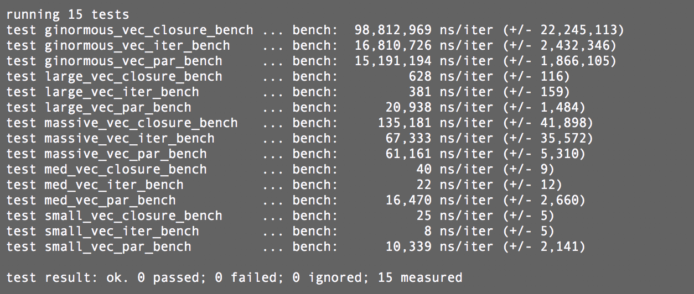

## Rust Benchmarking

### Normal Couples Talk

Recently my wife and I were talking about Rust and Rust loops (as a totally normal couple does). We were wondering what the faster way of traversing a loop were a `for` loop with `.iter()` or a closure from the `.iter()`. Turns out the answer is it depends! Normally I'm dealing with bytes (so `u8`) and doing fairly easy math over a vector and `.iter()` is slightly faster; however anything more complex a closure is the Rust way and faster.

### Onto the Benchmarking

So the best way to test this is using [Rust Nightly](https://www.rust-lang.org/en-US/install.html) and the `cargo bench` feature. This involves using the [Bencher crate](https://crates.io/crates/bencher). I found the documentation great, but I wanted to write up a post describing the full process of setting up the tests.

#### Cargo.toml

Included in the`Cargo.toml` file are:


```
[dependencies]
rayon = "*"
rand = "*"
bencher = "*"

[[bench]]
name = "main"
harness = false
```

Here [[bench]] is the trigger for the `Benches` crate to look into a `benches` folder (at the top level with `src` and `target`) for the file `main.rs` This is the file the `cargo bench` command will run on. The reason I called this main here instead of a proper test name is, for this example I just symbolicly linked the main under `src` to the `benches` folder. I am a heathen I know, but it got the job done. Normally we would import our crate and set up a separate test suite.

### main.rs

First, well do the `extern crate` and `use` dance:

```rust
extern crate rayon;
extern crate rand;
#[macro_use]
extern crate bencher;

use bencher::Bencher;
use rayon::prelude::*;
use rand::{thread_rng, Rng};

```

Next, we will set up the functions we want to test. The Bencher crate will test *everything* in the function so we want to make sure we're not loading or creating data in the function or our test results will be off:

```rust
fn vec_iter(test_vec: &mut Vec<u8>) -> () {
    for i in test_vec.iter_mut() {
        *i += 1;
    }
}

fn vec_par(test_vec: &mut Vec<u8>) {
    test_vec.par_iter_mut().for_each(|i| *i +=1);
}

fn vec_closure(test_vec: &mut Vec<u8>) {
    test_vec.iter_mut().map(|i| *i+1).collect::<Vec<_>>();
}
```

Keep in mind this is all _outside_ of a main function. Next we will set up the functions for bench here's the first three in my code:

```rust
    fn small_vec_par_bench(bench: &mut Bencher) {
        let mut small_vec: Vec<u8> = Vec::with_capacity(20);
        unsafe {small_vec.set_len(20)}
        thread_rng().fill_bytes(&mut small_vec);

        bench.iter(|| {vec_par(&mut small_vec)});
    }

    fn small_vec_iter_bench(bench: &mut Bencher) {
        let mut small_vec: Vec<u8> = Vec::with_capacity(20);
        unsafe {small_vec.set_len(20)}
        thread_rng().fill_bytes(&mut small_vec);

        bench.iter(|| {vec_iter(&mut small_vec)});
    }

    fn small_vec_closure_bench(bench: &mut Bencher) {
        let mut small_vec: Vec<u8> = Vec::with_capacity(20);
        unsafe {small_vec.set_len(20)}
        thread_rng().fill_bytes(&mut small_vec);

        bench.iter(|| {vec_closure(&mut small_vec)});
    }
```

Again, I know I am a heathen so ignore the `unsafe` blocks for this example. Let's look at the function, first the parameter to the signature is a bench instance `bench: &mut Bencher`. This is a struct that runs our code several times to get the timing information with a +/- value for more accuracy. Next I am setting up the test data just some arbitrary bytes filled with the `rand` function. Finally we call that function in the `bench.iter()` closure form. This will test just what we put in the closure for the timing tests.

For completeness here's the rest of my tests:

```rust

    fn med_vec_par_bench(bench: &mut Bencher) {
        let mut med_vec: Vec<u8> = Vec::with_capacity(1000);
        unsafe {med_vec.set_len(1000)}
        thread_rng().fill_bytes(&mut med_vec);

        bench.iter(|| {vec_par(&mut med_vec)});
    }

    fn med_vec_iter_bench(bench: &mut Bencher) {
        let mut med_vec: Vec<u8> = Vec::with_capacity(1000);
        unsafe {med_vec.set_len(1000)}

        thread_rng().fill_bytes(&mut med_vec);

        bench.iter(|| {vec_iter(&mut med_vec)});
    }

    fn med_vec_closure_bench(bench: &mut Bencher) {
        let mut med_vec: Vec<u8> = Vec::with_capacity(1000);
        unsafe {med_vec.set_len(1000)}
        thread_rng().fill_bytes(&mut med_vec);

        bench.iter(|| {vec_closure(&mut med_vec)});
    }

    fn large_vec_par_bench(bench: &mut Bencher) {
        let mut large_vec: Vec<u8> = Vec::with_capacity(20000);
        unsafe {large_vec.set_len(20000)}
        thread_rng().fill_bytes(&mut large_vec);

        bench.iter(|| {vec_par(&mut large_vec)});
    }

    fn large_vec_iter_bench(bench: &mut Bencher) {
        let mut large_vec: Vec<u8> = Vec::with_capacity(20000);
        unsafe {large_vec.set_len(20000)}
        thread_rng().fill_bytes(&mut large_vec);

        bench.iter(|| {vec_iter(&mut large_vec)});
    }

    fn large_vec_closure_bench(bench: &mut Bencher) {
        let mut large_vec: Vec<u8> = Vec::with_capacity(20000);
        unsafe {large_vec.set_len(20000)}
        thread_rng().fill_bytes(&mut large_vec);

        bench.iter(|| {vec_closure(&mut large_vec)});
    }

    fn massive_vec_par_bench(bench: &mut Bencher) {
        let mut massive_vec: Vec<u8> = Vec::with_capacity(2000000);
        unsafe {massive_vec.set_len(2000000)}
        thread_rng().fill_bytes(&mut massive_vec);

        bench.iter(|| {vec_par(&mut massive_vec)});
    }

    fn massive_vec_iter_bench(bench: &mut Bencher) {
        let mut massive_vec: Vec<u8> = Vec::with_capacity(2000000);
        unsafe {massive_vec.set_len(2000000)}
        thread_rng().fill_bytes(&mut massive_vec);

        bench.iter(|| {vec_iter(&mut massive_vec)});
    }

    fn massive_vec_closure_bench(bench: &mut Bencher) {
        let mut massive_vec: Vec<u8> = Vec::with_capacity(2000000);
        unsafe {massive_vec.set_len(2000000)}
        thread_rng().fill_bytes(&mut massive_vec);

        bench.iter(|| {vec_closure(&mut massive_vec)});
    }

        fn ginormous_vec_par_bench(bench: &mut Bencher) {
        let mut ginormous_vec: Vec<u8> = Vec::with_capacity(200000000);
        unsafe {ginormous_vec.set_len(200000000)}
        thread_rng().fill_bytes(&mut ginormous_vec);

        bench.iter(|| {vec_par(&mut ginormous_vec)});
    }

    fn ginormous_vec_iter_bench(bench: &mut Bencher) {
        let mut ginormous_vec: Vec<u8> = Vec::with_capacity(200000000);
        unsafe {ginormous_vec.set_len(200000000)}
        thread_rng().fill_bytes(&mut ginormous_vec);

        bench.iter(|| {vec_iter(&mut ginormous_vec)});
    }

    fn ginormous_vec_closure_bench(bench: &mut Bencher) {
        let mut ginormous_vec: Vec<u8> = Vec::with_capacity(200000000);
        unsafe {ginormous_vec.set_len(200000000)}
        thread_rng().fill_bytes(&mut ginormous_vec);

        bench.iter(|| {vec_closure(&mut ginormous_vec)});
    }
```

Finally we need to tell the bencher which functions to include and test. We do this by first naming and then giving the function signatures to a `benchmark_group!()` macro (hence the `#[marco_use]` on our crate import).

```rust
benchmark_group!(benches,
small_vec_iter_bench, small_vec_par_bench, small_vec_closure_bench,
med_vec_iter_bench, med_vec_par_bench, med_vec_closure_bench,
large_vec_iter_bench, large_vec_par_bench,large_vec_closure_bench,
massive_vec_iter_bench, massive_vec_par_bench, massive_vec_closure_bench,
ginormous_vec_closure_bench, ginormous_vec_iter_bench, ginormous_vec_par_bench);
```

Lastly, a macro call to the `benchmark_main!()`giving it the group we wish to test.

```rust
benchmark_main!(benches);
```

### Results and Conclusion

That's it! We can now run `cargo bench` and get some results! Here's the results on my Macbook Pro (3.1 GHz Intel Core i5):



Overall the benchmark suite is really easy to use, because you use closures to send off the exact code to test it is also very accurate. So go refactor some code and performance test to get the most out of Rust! 
